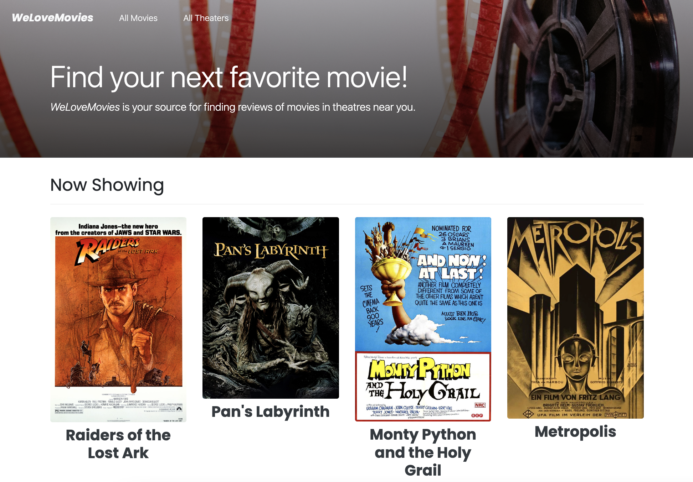
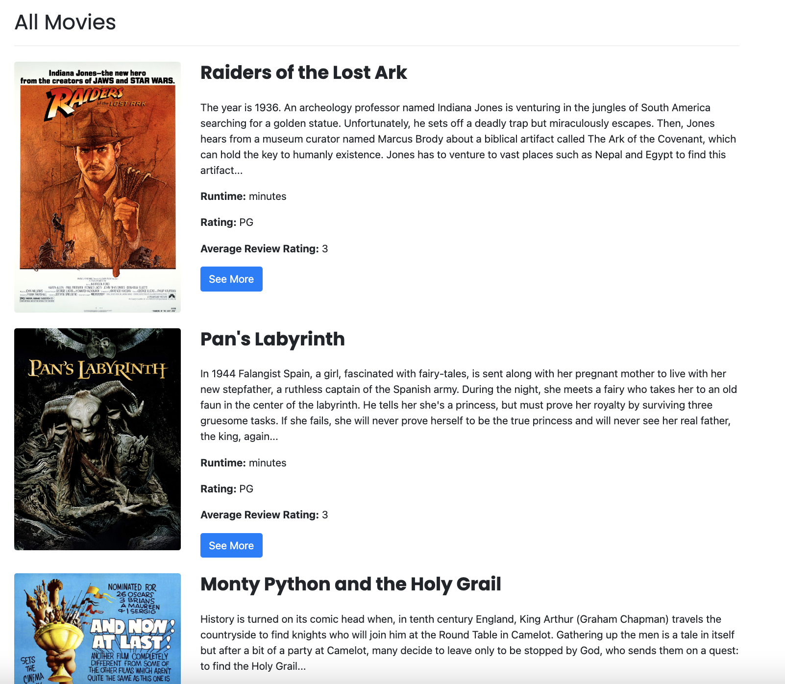
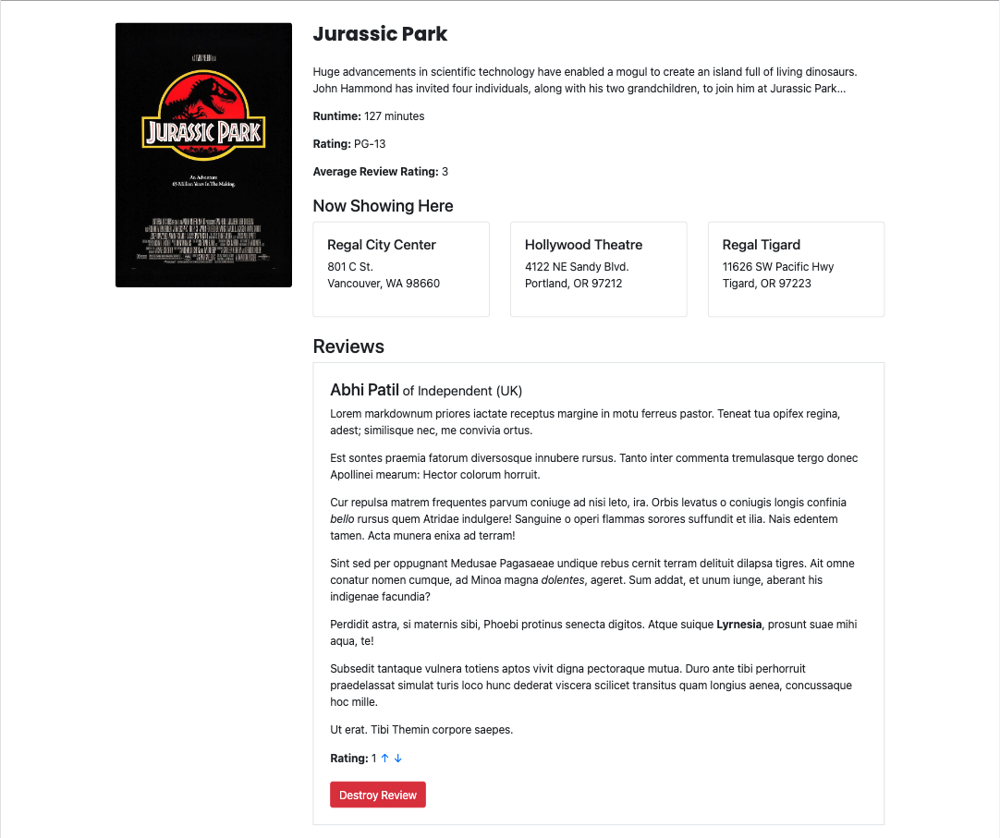
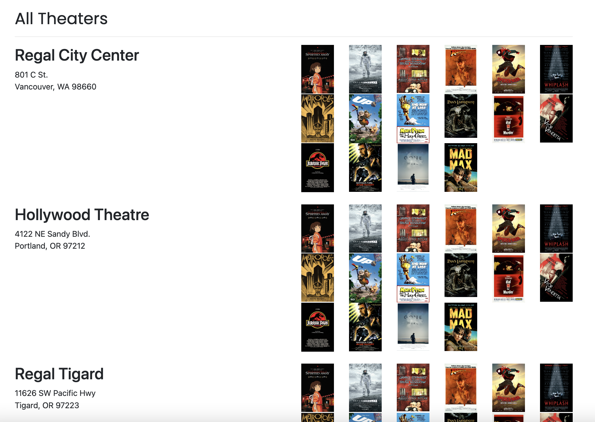

# We Love Movies

## Live Website

A live version of WeLoveMovies Application is able to be accessed through Render: [Live Render Application](https://welovemovies-frontend-91f9.onrender.com/).

## Table of Contents

- [Summary](#summary)
- [Technology Used](#technology)
- [Features](#features)

## Summary

This application allows users to see list of movies and a list of movie theaters that are showing those movies, along with all the details of each movie, including reviews.

## Technology Used

### Front-End ( client )

- React.js
- Javascript
- Bootstrap 4

### Back-end

- NodeJS
- PostgreSQL
- Knex.js
- Express

### Testing

- Jest
- Supertest

## Features

### Home Screen ( Now Showing )

The home screen of the application shows a list of all movies that are currently playing in theaters. Users are able to click each movie to see details.

### Movies Screen ( All Movies )

Clicking "All Movies" in the navigation bar brings users to the all movies screen. This screen lists all movies regardless of whether they are currently showing. Clicking on a "See More" button will bring the user to the movie screen of that specific movie.

### Individual Movie ( click see more )

This will bring you to the individual movie the user clicks on. Listing the runtime, rating, average review, critic reviews and theater options.

### All Theaters Screen

Clicking on "All Theaters" in the navigation bar brings users to the all theaters screen. This screen lists all theaters along with a list of movies that are currently playing in that theater. Clicking on a movie will bring the user to the movie screen of that specific movie.

